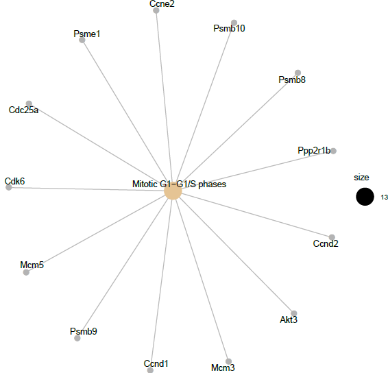

```{r, include= FALSE}
chooseCRANmirror(graphics=FALSE, ind=1)
install.packages("knitr")
install.packages("gplots")

if (!requireNamespace("BiocManager", quietly = TRUE))
    install.packages("BiocManager")

BiocManager::install("Biobase")
BiocManager::install("arrayQualityMetrics")
BiocManager::install("affy")
BiocManager::install("oligo")
BiocManager::install("oligoClasses")
BiocManager::install("pd.mogene.1.0.st.v1")
BiocManager::install("mogene10sttranscriptcluster.db")
BiocManager::install("genefilter")
BiocManager::install("limma")
BiocManager::install("GEOquery")
BiocManager::install("annotate")
BiocManager::install("AnnotationDbi")
BiocManager::install("org.Mm.eg.db")
BiocManager::install("ReactomePA")
BiocManager::install("reactome.db")
```


```{r , include =FALSE}
#packages
library(Biobase)
library(arrayQualityMetrics)
library(affy)
library(Biobase)
library(BiocManager)
library(oligoClasses)
library(oligo)
library(pd.mogene.1.0.st.v1)
library(mogene10sttranscriptcluster.db)
library(genefilter)
library(limma)
library(GEOquery)
library(annotate)
library(AnnotationDbi)
library(gplots)
library(org.Mm.eg.db)
library(ReactomePA)
library(reactome.db)
```

```{r , include =FALSE}
setwd(".")
dir.create("data")
dir.create("results")
```

El proyecto reproducible de este análisis se encuentra en un repositorio github. Para acceder a él se puede seguir este enlace: https://github.com/MarcBanuls/banuls_marc_PECS_OMICAS.git

# Abstract

El factor de crecimiento transformante beta (TGF-B) es una citocina involucrada en varios procesos celulares relacionados principalmente con el desarrollo del organismo y la embriogénesis. Esta proteína (entre otras funciones) promueve la producción de fibras en el hígado, pero recientemente se ha descubierto que la proteína de membrana Caveolina-1 (CAV1) bloquea la señalización de las TGF-B y promueve su apoptosis. Por ello, se quiere observar en qué genes y rutas metabólicas afecta concretamente CAV1 a la proteína TGF-B para producir este efecto. Gracias al análisis de los arrays se han obtenido varias rutas metabólicas afectadas por el silenciamiento de CAV1 en un medio con TGF-B.

# Objetivos

En esta investigación se pretende estudiar de manera concreta el efecto que tiene la presencia o ausencia de la proteína de membrana CAV1 en las funciones de la citocina TGF-B. Para analizar esto, se realizan análisis de microarrays procedentes del estudio que posteriormente se analizarán para comprobar qué rutas metabólicas y genes se ven alterados en presencia o ausencia de CAV1 cuando son tratados (o no ) con TGF-B.


# Materiales y Métodos

## Obtención de datos previos al análisis y materiales
Las muestras originales utilizadas para realizar microarrays son células hepatocíticas procedentes de ratones. Éstas células son transfectadas con siCon o siCAV1 (control e inhibición de la proteína CAV1 respectivamente). 
Después de obtener las células transfectadas deseadas, se tratan las distintas células transfectadas con una solución de TGF-beta durante 48 horas (o no, debido a no realizar el tratamiento para obtener muestras control). 
Finalmente se obtiene el RNA de las distintas muestras para realizar los distintos microarrays.   

El diseño experimental de este estudio consiste en realizar el análisis de 12 muestras. Se comparan los niveles de expresión génica entre hepatocitos control y hepatocitos con el gen CAV1 silenciado cuando están tratadas durante 2 días con TGF-B o no se tratan con éstos. Se realizan triplicados para cada uno de las cuatro combinaciones de tratamientos.   

Los microarrays utilizados en este estudio son los utilizados en el paper de @han2019caveolin de Affymetrix para el organismo de *Mus musculus*. Concretamente el microarray se llama [MoGene-1_0-st] Affymetrix Mouse Gene 1.0 ST Array [CDF: MoGene10stv1_Mm_ENTREZG_16.0.0].   

## Métodos

El pipeline que hemos seguido para obtener los resultados del análisis, junto con los pasos realizados en cada parte del pipeline es:

### Preparación de los datos   


Descargamos los archivos CEL del experimento y los introducimos en el directorio Data. Creamos además el archivo "targets" en formato csv para determinar en que grupo se encuentra cada muestra y añadir más información. Hemos introducido 5 columnas en el archivo "targets.csv":

+ Filename: Nombre de la muestra CEL completa
+ Group: Resumen de las condiciones en las que se encuentra la muestra
+ Genotype: Genotipo de la muestra
+ Treatment: Tipo de tratamiento realizado
+ ShortName: Nombre creado para identificar fácilmente cada muestra específicamente

Podríamos haber introducido también la edad y especie de cada muestra, pero al ser todas las muestras iguales en ese aspecto no lo hemos considerado necesario.

```{r , include =FALSE}
targets <- read.csv2("./data/targets.csv", header = T, sep = ";")
```

### Lectura de los archivos CEL   

 
Leemos los archivos CEL teniendo en cuenta que están comprimidos (formato zip) y sustituimos los nombres de las muestras por sus nombres atribuidos en "Shortnames".

```{r , include =FALSE}
# Tener en cuenta que los archivos .CEL están comprimidos
celFiles <- list.celfiles("./data",full.names = TRUE, listGzipped = T)

my.targets <- read.AnnotatedDataFrame(file.path("./data", "targets.csv"), header = T, row.names = 1, sep = ";")
rawdata <- read.celfiles(celFiles, phenoData = my.targets)


# Sustituimos los nombres de las muestras por sus nombres "ShortName" específicos
rownames(pData(rawdata)) <- my.targets@data$ShortName
colnames(rawdata) <- rownames(pData(rawdata))
```


### Control de calidad y normalización   


Realizamos un control de calidad de las muestras CEL crudas leídas para obtener un resumen de la calidad de estas muestras sin normalizar. Para obtener los resultados del control de calidad utilizamos el paquete *arrayQualityMetrics* (@array).

```{r , include =FALSE}
arrayQualityMetrics(rawdata, outdir = file.path("./results", "ArrayQualityMetrics_rawData"), force = T, intgroup = "Group")
```


Posteriormente utilizamos utilizamos el método de normalización mediante RMA (Robust Multichip Analysis) (@irizarry),  para así obtener las muestras normalizadas a partir de los datos crudos. Para ello utilizamos el paquete *affy* (@affy)

```{r , include =FALSE}
eset_rma <- rma(rawdata)
```

Realizamos de nuevo un control de calidad con los datos ya normalizados, obteniendo un resumen de la calidad de las muestras normalizadas.

```{r , include =FALSE}
arrayQualityMetrics(eset_rma, outdir = file.path("./results", "ArrayQualityMetrics_Norm"), force = T, intgroup = "Group")
```

### Filtraje no específico    

Realizamos un filtraje de los genes mediante el paquete *genefilter* (@genefilter)  que menos variación tengan o que no estén anotados adecuadamente a partir de las muestras normalizadas, para así facilitar los posteriores análisis. De esta manera obtenemos las muestras normalizadas y filtradas (eliminando IDs no anotados correctamente). 

```{r , include =FALSE}
annotation(eset_rma) <- "mogene10sttranscriptcluster.db"
filtered <- nsFilter(eset_rma, 
                    require.entrez = TRUE, remove.dupEntrez = TRUE,
                    var.filter=TRUE, var.func=IQR, var.cutoff=0.75, 
                    filterByQuantile=TRUE, feature.exclude = "^AFFX")
```


```{r , include =FALSE}
eset_filtered <- filtered$eset
```

```{r , include =FALSE}
# Guardado de resultados
write.csv2(exprs(eset_rma), file = "./results/normalized_data.csv")
write.csv2(exprs(eset_filtered), file = "./results/normalized_filt_data.csv")
```

### Identificación de genes diferencialmente expresados   


Para encontrar los genes diferencialmente expresados debemos observar los genes que presentan diferencias entre los distintos grupos. Para ello, podemos crear una gráfica de variabilidad de cada gen entre los distintos grupos utilizando la desviación estándar de estos genes como referencia de variabilidad. Para encontrar los genes más diferencialmente expresados, podemos filtrar por aquellos que tienen una desviación estándar mayor al 90-95% de las desviaciones estándar.

### Selección de genes diferencialmente expresados   

Para realizar la selección de los genes que se encuentran diferencialmente expresados nos basamos en la utilización del paquete *limma* (@limma) para construir un modelo lineal.


#### Matriz de diseño   


Primero hemos de construir una matriz de diseño. Como se sugiere en el manual de *limma*, interpretaremos los grupos del estudio como un modelo de un factor con 4 niveles:
+ CAV1.TGF (células con el gen CAV1 silenciado y tratadas durante 48 horas con TGF-B)
+ CAV1.CTRL(células con el gen CAV1 silenciado sin tratamiento)
+ WT.TGF (células control y tratadas durante 48 horas con TGF-B)
+ WT.CTRL (células control sin tratamiento)

```{r, fig.cap="Matriz de diseño", echo=FALSE}
design.l <- matrix(
  c(1,1,1,0,0,0,0,0,0,0,0,0,
    0,0,0,1,1,1,0,0,0,0,0,0,
    0,0,0,0,0,0,1,1,1,0,0,0,
    0,0,0,0,0,0,0,0,0,1,1,1),
  nrow = 12,
  byrow = F)
colnames(design.l) <- c("CAV1.TGF", "CAV1.CTRL", "WT.TGF", "WT.CTRL")
rownames(design.l) <- c("CAV1.TGF.1", "CAV1.TGF.2", "CAV1.TGF.3", "CAV1.CTRL.1", "CAV1.CTRL.2", "CAV1.CTRL.3", "WT.TGF.1", "WT.TGF.2",
                        "WT.TGF.3", "WT.CTRL.1", "WT.CTRL.2", "WT.CTRL.3")
print(design.l)
```

#### Contrastes
A partir de esta matriz de diseño ya podemos formular las comparaciones entre grupos convenientes. Para ello, utilizaremos matrices de contrastes. Las comparaciones que queremos hacer es:
- ¿Hay diferencias entre las células con el gen CAV1 silenciado y las que no lo tienen cuando son tratadas con TGF-B?
- ¿Hay diferencias entre las células con el gen CAV1 silenciado y las que no lo tienen cuando no son tratadas con TGF-B?
- ¿Existe una relación entre el tipo de célula (con el gen CAV1 silenciado o no) y la realización (o no) del tratamiento en estas células?   


Para ello, utilizaremos de nuevo el paquete *limma*.

```{r, fig.cap="Matriz de contrastes", echo=FALSE}
cont.matrix <- makeContrasts(CAV1.TGFvsWT.TGF = CAV1.TGF - WT.TGF,
                             CAV1.CTRLvsWT.CTRL = CAV1.CTRL - WT.CTRL, 
                             INT = (CAV1.TGF - WT.TGF) - (CAV1.CTRL - WT.CTRL),
                             levels = design.l)
print(cont.matrix)
```

De esta manera observaremos el efecto de tratar las células con TGF-B durante 48 horas o no realizar este tratamiento en las células que tienen o no silenciado el gen CAV1, y la interacción entre las células con el gen CAV1 silenciado y el haberla tratado o no. 

#### Estimación del modelo y selección de genes   


Pasamos a estimar los modelos y contrastes junto con la realización de pruebas de significación, utilizando el método implementado en el paquete *limma*, el cual utiliza el análisis mediante Bayes empírico.

```{r , include =FALSE}
fit <- lmFit(eset_filtered, design.l)
fit.main <- contrasts.fit(fit, cont.matrix)
fit.main <- eBayes(fit.main)
```

Ahora que tenemos el modelo de Bayes empírico en nuestro modelo, deseamos realizar tres comparaciones:

+ Comparación 1: Genes con cambios en su expresión entre cepas cuando se encuentran en ayunas durante 6 horas:
+ Comparación 2: Genes con cambios en su expresión entre cepas cuando no se encuentran en ayunas:
+ Comparación 3: Genes con cambios en su expresión entre las comparaciones 1 y 2

```{r , include =FALSE}
topTab_CAV1.TGFvsWT.TGF <- topTable(fit.main, number = nrow(fit.main), coef = "CAV1.TGFvsWT.TGF", adjust = "fdr")
topTab_CAV1.CTRLvsWT.CTRL <- topTable(fit.main, number = nrow(fit.main), coef = "CAV1.CTRLvsWT.CTRL", adjust = "fdr")
topTab_INT <- topTable(fit.main, number = nrow(fit.main), coef = "INT", adjust = "fdr")
```


### Anotación de los resultados   


Teniendo todos los genes cuya expresión ha sido más significativa en los contrastes realizados, debemos identificarlos correctamente. Para ello, utilizamos la función creada y suministrada en el material del curso (@alex), y guardamos los genes con sus valores en nuevas tablas.

```{r , include =FALSE}
annotatedTopTable <- function(topTab, anotPackage) {
  topTab <- cbind(PROBEID=rownames(topTab),topTab)
  myProbes <- rownames(topTab)
  thePackage <- eval(parse(text = anotPackage))
  geneAnots <- AnnotationDbi::select(thePackage, myProbes, c("SYMBOL", "ENTREZID", "GENENAME"))
  annotatedTopTab <- merge(x=geneAnots, y=topTab, by.x="PROBEID", by.y="PROBEID")
  return(annotatedTopTab)
}
```

```{r , include =FALSE}
topAnnotated_CAV1.TGFvsWT.TGF <- annotatedTopTable(topTab_CAV1.TGFvsWT.TGF, anotPackage = "mogene10sttranscriptcluster.db")
topAnnotated_topTab_CAV1.CTRLvsWT.CTRL <- annotatedTopTable(topTab_CAV1.CTRLvsWT.CTRL, anotPackage = "mogene10sttranscriptcluster.db")
topAnnotated_INT <- annotatedTopTable(topTab_INT, anotPackage = "mogene10sttranscriptcluster.db")
```

```{r , include =FALSE}
# Guardamos los los datos anotados
write.csv2(topAnnotated_CAV1.TGFvsWT.TGF, file="./results/topAnnotated_CAV1.TGFvsWT.TGF.csv")
write.csv2(topAnnotated_topTab_CAV1.CTRLvsWT.CTRL, file="./results/topAnnotated_topTab_CAV1.CTRLvsWT.CTRL.csv")
write.csv2(topAnnotated_INT, file="./results/topAnnotated_INT.csv")
```

## Comparaciones múltiples   


Para realizar comparaciones múltiples utilizamos también el paquete *limma*. De esta manera, podemos observar el número de genes que se han visto "down-regulated" o "up-regulated" (o sin diferencias significativas) en cada comparación. 
```{r , include= FALSE}
res <- decideTests(fit.main, method = "separate", adjust.method = "fdr", p.value = 0.1, lfc = 1)
sum.res.rows<-apply(abs(res),1,sum)
res.selected<-res[sum.res.rows!=0,] 
```


### Análisis de significación biológica   


con las comparaciones de genes podemos interpretar como afectan los genes con significación dentro del contexto biológico. Para ello, utilizamos el paquete ReactomePA de Bioconductor. En este análisis reslizamos una selección poco restrictiva de los genes diferencialmente expresados para poder tener una cantidad de genes aceptable para analizar. Para ello preparamos la lista de genes para analizar y utilizaremos como universo todos los genes que tengan almenos alguna anotación en Gene Ontology. Para realizar este proceso utilizamos el paquete *AnnotationDbi* (@annotation).   

```{r , include =FALSE}
listOfTables <- list(CAV1.TGFvsWT.TGF = topTab_CAV1.TGFvsWT.TGF,
                     CAV1.CTRLvsWT.CTRL = topTab_CAV1.CTRLvsWT.CTRL,
                     INT = topTab_INT)
listOfSelected <- list()
for (i in 1:length(listOfTables)) { 
  # Select topTable
  topTab <- listOfTables[[i]]
  # Select genes
  whichGenes <- topTab["adj.P.Val"]<0.15
  selectedIDs <- rownames(topTab)[whichGenes]
  # Convert ID to Entrez
  EntrezIDs <- AnnotationDbi::select(mogene10sttranscriptcluster.db, selectedIDs, c("ENTREZID"))
  EntrezIDs <- EntrezIDs$ENTREZID
  listOfSelected[[i]] <- EntrezIDs
  names(listOfSelected)[i] <- names(listOfTables)[i]
}
sapply(listOfSelected, length)
```


```{r , include =FALSE}
mapped_genes2GO <- mappedkeys(org.Mm.egGO)
mapped_genes2KEGG <- mappedkeys(org.Mm.egPATH)
mapped_genes <- union(mapped_genes2GO , mapped_genes2KEGG)
```


Utilizando el paquete *reactomePA* (@reactome) podemos realizar un análisis de enriquecimiento utilizando el universo y la selección de genes diferencialmente expresados anteriormente. Con este análisis obtenemos un esquema de las rutas metabólicas y gráficos de barras que contienen los genes diferencialmente expresados. 

```{r , include = FALSE}
#El modelo de la última comparación tiene muy pocos genes que difcultan la obtención de resultados significativos en este análisis de enriquecimiento
listOfData <- listOfSelected[1:2]
comparisonsNames <- names(listOfData)
universe <- mapped_genes

for (i in 1:length(listOfData)){
 genesIn <- listOfData[[i]]
 comparison <- comparisonsNames[i]
 enrich.result <- enrichPathway(gene = genesIn,
                                pvalueCutoff = 0.05,
                                readable = T,
                                pAdjustMethod = "BH",
                                organism = "mouse",
                                universe = universe)

 if (length(rownames(enrich.result@result)) != 0) {
 write.csv(as.data.frame(enrich.result), 
            file =paste0("./results/","ReactomePA.Results.",comparison,".csv"), 
            row.names = FALSE)
 
 pdf(file=paste0("./results/","ReactomePABarplot.",comparison,".pdf"))
   print(barplot(enrich.result, showCategory = 15, font.size = 4, 
           title = paste0("Reactome Pathway Analysis for ", comparison,". Barplot")))
 dev.off()
 
 pdf(file = paste0("./results/","ReactomePAcnetplot.",comparison,".pdf"))
   print(cnetplot(enrich.result, categorySize = "geneNum", schowCategory = 15, 
        vertex.label.cex = 0.75))
 dev.off()
 }
}
```

# Resultados   

## Control de calidad   

### Tablas resumen del análisis de outliers   

Durante el control de calidad de los datos crudos hemos observado que existen varios arrays que presentan outliers pero sólo en uno de los tres métodos de análisis utilizados por el paquete. Concretamente los outliers aparecen en los gráficos "MA". Al no corroborarse la detección de outliers en los distintos arrays por más de un método, podemos proseguir con la normalización.

```{r, fig.cap="Detección de outliers en los microarrays del estudio con datos crudos", echo=FALSE}

```

En el control de calidad de los datos normalizados no se observa ningún tipo de outlier dentro de los métodos de detección de estos, confirmando que los posibles outliers del array con los datos crudos eran debidos a una falta de normalización.

```{r, fig.cap="Detección de outliers en los microarrays del estudio con datos normalizados", echo=FALSE}

```

### Gráficos PCA
También podemos observar en los gráficos PCA generados en cada análisis de detección de outliers de los datos crudos y normalizados:

```{r, fig.cap="Detección de outliers mediante PCA", echo=FALSE}
knitr::include_graphics(c("figures/PCAraw.PNG","figures/PCAnorm.PNG"))
```

En ambos gráficos PCA no observamos ninguna anormalidad que nos indique alguna variación de outliers.

### Boxplots

Por último observamos mediante gráficos de boxplot en ambos datos (crudos y normalizados) la presencia de outliers:
```{r, fig.cap="Detección de outliers en datos crudos mediante boxplots", echo=FALSE}

```

```{r, fig.cap="Detección de outliers en datos normalizados mediante boxplots", echo=FALSE}

```
Tampoco observamos ningún outlier significativo en los gráficos de cajas, tanto para los datos crudos como para los normalizados, por lo que podemos proseguir con seguridad con el análisis del estudio.

## Genes diferencialmente expresados

### Genes con mayor variabilidad

En este gráfico podemos hacernos una idea de los genes con mayor variabilidad:

```{r, echo= FALSE}
sds <- apply(exprs(eset_rma), 1, sd)
sds0 <- sort(sds)
plot(1:length(sds0), sds0, main = "Variabilidad de los genes", sub = "Las líneas verticales señalan los percentiles del 90% y 95%", xlab = "Índice de genes (de menor a mayor variabilidad)", ylab = "Desviación estándar")
abline(v = length(sds) * c(0.9, 0.95))
```

Observamos que de los 35000 genes del estudio, tan solo unos 2000 tienen una desviación estándar entre los percentiles al 90-95%.


### Gráficos de volcán
Después de normalizar los datos pasamos y encontrar los genes diferencialmente expresados pasamos a observar los genes diferencialmente expresados en cada comparación. Podemos realizar un gráfico de volcán para observar qué genes son los que están más (o menos) diferencialmente expresados:

```{r, echo= FALSE, warning= FALSE, message= FALSE, fig.cap="Detección de genes diferencialmente expresados en las distintas comparaciones", echo=FALSE}

par(mfrow=c(2,2))
geneSymbols <- AnnotationDbi::select(mogene10sttranscriptcluster.db, rownames(fit.main), c("SYMBOL"))
SYMBOLS<- geneSymbols$SYMBOL
volcanoplot(fit.main, coef=1, highlight=4, names=SYMBOLS, 
            main=paste("Differentially expressed genes", colnames(cont.matrix)[1], sep="\n"))
abline(v=c(-1,1))

volcanoplot(fit.main, coef=2, highlight=4, names=SYMBOLS, 
            main=paste("Differentially expressed genes", colnames(cont.matrix)[2], sep="\n"))
abline(v=c(-1,1))

volcanoplot(fit.main, coef=3, highlight=4, names=SYMBOLS, 
            main=paste("Differentially expressed genes", colnames(cont.matrix)[3], sep="\n"))
abline(v=c(-1,1))


```

### Mapa de calor
Ahora realizamos un mapa de calor para observar qué genes son los más o menos expresados y su comparación con los otros grupos (escogemos los genes que han estado diferenciamente expresados en almenos una comparación):

```{r, include= FALSE}
probesInHeatmap <- rownames(res.selected)
HMdata <- exprs(eset_filtered)[rownames(exprs(eset_filtered)) %in% probesInHeatmap,]

geneSymbols <- select(mogene10sttranscriptcluster.db, rownames(HMdata), c("SYMBOL"))
SYMBOLS<- geneSymbols$SYMBOL
rownames(HMdata) <- SYMBOLS
write.csv(HMdata, file = file.path("./results/data4Heatmap.csv"))
```


```{r, echo= FALSE}
my_palette <- colorRampPalette(c("blue", "red"))(n = 299)
heatmap.2(HMdata,
         Rowv = TRUE,
         Colv = TRUE,
         dendrogram = "both",
         main = "Genes diferencialmente expresados \n (FDR < 0,1, logFC >=1)",
         scale = "row",
         col = my_palette,
         sepcolor = "white",
         sepwidth = c(0.05,0.05),
         cexRow = 0.5,
         cexCol = 0.9,
         key = TRUE,
         keysize = 1.5,
         density.info = "histogram",
         ColSideColors = c(rep("red",3),rep("blue",3), rep("green",3), rep("yellow",3)),
         tracecol = NULL,
         srtCol = 30)
```

De esta manera observamos una elevada cantidad de genes que están inhibidos en las muestras no tratadas y expresados en las muestras tratadas (donde se encuentra una mayor diferenciación en las células con el gen CAV1 inhibido) gracias a la observación de la expresión positiva o negativa mediante código de colores (azul para expresión baja y rojo para sobre-expresión).

### Diagrama de Venn

Construimos una matriz con los genes significativos entre las comparaciones para observar la cantidad de genes sobre-expresados o inhibidos en cada comparación.

```{r, echo= FALSE, fig.cap="Número de genes significativos al 1% en las distintas comparaciones"}
print(summary(res.selected))
```


Con una significancia del 1%, observamos que en la comparación entre células con el gen CAV1 silenciado o no con tratamiento de TGF-B, hay 19 genes sobre-expresados y 3 genes inhibidos. en la comparación entre células con el gen CAV1 silenciado o no sin tratamiento, hay 12 genes sobre-expresados y 3 genes inhibidos. Finalmente en la comparación entre estas dos comparaciones tan solo observamos la sobre-expresión de 2 genes.   

Además, se puede observar de manera gráfica mediante un diagrama de Venn el número de genes en común diferencialmente expresados entre las distintas comparaciones.

```{r, echo= FALSE, fig.cap="Diagrama de Venn con las relaciones de genes diferencialmente expresados entre comparaciones"}
vennDiagram (res.selected[,1:3], cex = 0.9)
```


## Análisis de significación biológica

Finalmente, para obtener resultados de significación biológica a partir de los arrays analizados, hemos realizado un análisis de enriquecimiento con un nivel de significación del 5%. Como la comparación entre las dos primeras comparaciones (llamada "INT") no tiene valores por encima de este nivel de significación, no podemos realizar un análisis de enriquecimiento para ésta. Por ello, mostramos las tablas con las rutas metabólicas en las dos primeras comparaciones, mostrando sólo las cinco primeras rutas metabólicas significativas:

```{r, echo=FALSE, fig.cap= "Tablas de significación biológica"}
Tab.react_CAV1.CTRLvsWT.CTRL <- read.csv2(file.path("./results/ReactomePA.Results.CAV1.CTRLvsWT.CTRL.csv"), 
                       sep = ",", header = TRUE, row.names = 1)

Tab.react_CAV1.TGFvsWT.TGF <- read.csv2(file.path("./results/ReactomePA.Results.CAV1.TGFvsWT.TGF.csv"), 
                       sep = ",", header = TRUE, row.names = 1)

Tab.react_CAV1.CTRLvsWT.CTRL <- Tab.react_CAV1.CTRLvsWT.CTRL[1:4, 1:5]
Tab.react_CAV1.TGFvsWT.TGF <- Tab.react_CAV1.TGFvsWT.TGF[1:4, 1:5]

knitr::kable(Tab.react_CAV1.CTRLvsWT.CTRL, booktabs = TRUE, caption = "Rutas biológicas significativamente expresadas en CAV1.CTRLvsWT.CTRL")

knitr::kable(Tab.react_CAV1.TGFvsWT.TGF, booktabs = TRUE, caption = "Rutas biológicas significativamente expresadas en CAV1.TGFvsWT.TGF")
```

Como se puede observar, la comparación CAV1.CTRLvsWT.CTRL tan solo tiene una ruta metabólica significativa, indicando que en principio la inhibición del gen CAV1 no parece tener elevadas consecuencias cuando no hay presencia de TGF-B, concretamente afectando únicamente a la ruta metabólica de la mitosis celular en las fases G1 y G1-S. Al contrario que en esta comparación, la comparación CAV1.TGFvsWT.TGF si que indica varias rutas metabólicas afectadas. Esto implica que hay diferencias significativas en la expresión de varias rutas metabólicas entre las células con el gen CAV1 silenciado y las células control cuando ambas son tratadas con TGF-B. Como la comparación entre la interacción entre ambas comparaciones sólo tenía un gen con una significación al 1% se entiende que no hay rutas metabólicas afectadas entre las comparaciones mencionadas.   

También podemos mostrar en un gráfico de redes los genes significativos que están implicados en cada ruta metabólica. Primero observamos la ruta metabólica de la comparación CAV1.CTRLvsWT.CTRL:


```{r, fig.cap="Gráfico de redes de la comparación CAV1.CTRLvsWT.CTRL ", echo=FALSE, hold_position = T}

```

Y el gráfico de redes de cada ruta metabólica para la comparación CAV1.TGFvsWT.TGF:


```{r, fig.cap="Gráfico de redes de la comparación CAV1.TGFvsWT.TGF ", echo=FALSE,hold_position = T}

```

De esta manera podemos observar qué genes afectan a qué ruta metabolica significativamente.

## Resumen de archivos obtenidos
Aqui ponemos la tabla resumen con los datos y los distintos gráficos y tablas obtenidos:

```{r listOfFiles, echo=FALSE}
Lista_de_archivos <- dir("./results/") 
knitr::kable(
  Lista_de_archivos, booktabs = TRUE,
  caption = 'Lista de archivos obtenidos en el análisis',
  col.names="Lista_de_archivos"
)
```

# Discusión
Para obtener unos resultados con mayor fiabilidad sería recomendable utilizar una mayor cantidad de muestras, lo cual nos daría un mayor número de datos en los que confirmar las significaciones biológicas entre comparaciones.


# Conclusión

A partir de los datos del análisis de signficación biológica hemos observado que solo hay diferencias signficativas en una ruta metabólica entre los dos tipos distintos de células que no han sido tratadas con TGF-B. Aunque estamos hablando de una sola ruta metabólica, al ser concretamente la ruta de la fase de mitosis entre G1 y G1-S, un cambio significativo en esta fase puede afectar en gran medida al desarrollo celular y del organismo. Por ello, es una ruta metabólica a tener muy en cuenta y al que se podría investigar en más detalle qué efecto tiene la inhibición del gen CAV1 en esta ruta metabólica.   

En la tabla de significación biológica de la comparación de los dos tipos distintos de células cuando se han tratado con TGF-B se observan concretamente doce rutas metabólicas que se ven significativamente afectadas, indicando que en una situación de presencia de TGF-B, las células se comportan de manera distinta cuando tienen (o no) el gen CAV1 silenciado. Debido a la gran cantidad de rutas metabólicas afectadas y las posibles relaciones o interacciones entre ellas, no me veo con conocimientos necesarios para dar unas conclusiones de los datos detalladas o certeras. POr ello, tan solo se puede concluir en este informe en que se han observado unas claras diferencias en la comparación CAV1.TGFvsWT.TGF las cuales merecen un estudio más detallado.

# Apéndice

Todo el código utilizado se encuentra en el archivo ".rmd" en el repositorio github de la PEC1.


# References

